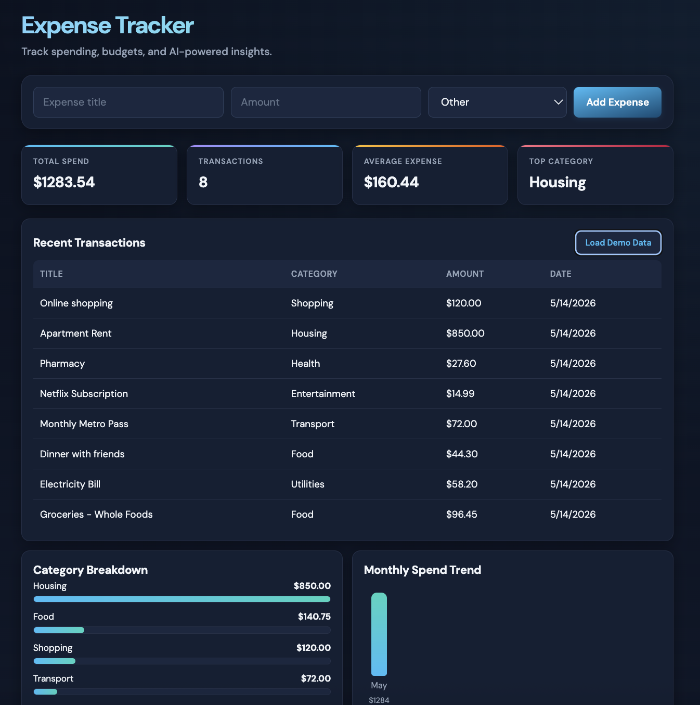
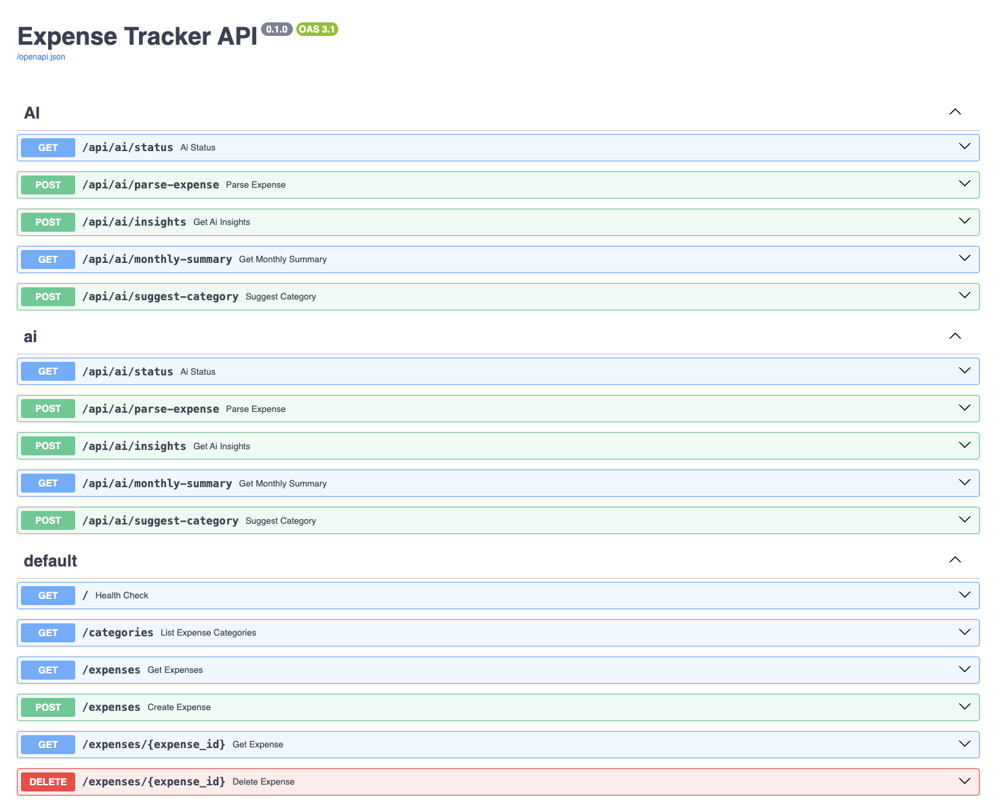
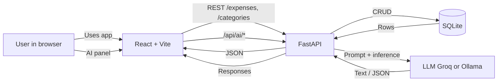
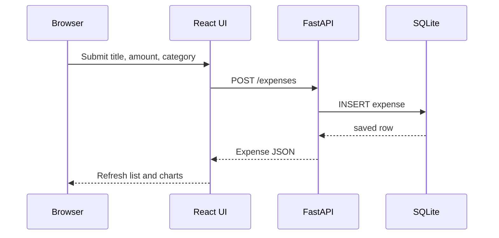

# Expense Tracker

Full-stack expense tracker: log spending by category, optional local budgets with alerts, charts for category and monthly trends, and an **AI** panel (parse natural language into an expense, insights, monthly summary). **API:** FastAPI + SQLAlchemy + SQLite. **UI:** React + Vite, deployed as a static site.

---

## UI (screenshots)

**Web dashboard** — add expense, KPIs, transactions, charts, budgets, AI assistant.



**OpenAPI docs** — same REST contract as production (`/docs` on the API).



---

## Architecture & data flow

### System context



### Creating an expense from the UI



**Notes:** Spend totals and category breakdowns are computed in the backend from stored rows. AI routes call the configured provider with fallbacks when the model is unavailable. Budgets are stored in `localStorage` in the browser.

---

## Live demo

| What | URL |
|------|-----|
| **App** | [https://expense-tracker-fe-wg3g.onrender.com](https://expense-tracker-fe-wg3g.onrender.com) |
| **API docs** | [https://expense-tracker-kwyf.onrender.com/docs](https://expense-tracker-kwyf.onrender.com/docs) |

## Features

- Add expenses with title, amount, and **category** from a server-defined list
- Dashboard KPIs, recent transactions, category breakdown, monthly spend trend
- **Budgets** in the browser with over-budget alerts
- **AI:** parse text → expense, spending Q&A, monthly summary, category suggestion (Groq or Ollama via env)
- UI respects **light / dark** from the OS

## Tech stack

| Layer | |
|-------|---|
| **Backend** | Python 3.11, FastAPI, SQLAlchemy, SQLite |
| **Frontend** | React 19, Vite 8, axios |
| **Hosting** | [Render](https://render.com) — web service + static site ([`render.yaml`](render.yaml)) |

## Local development

**Requirements:** Python 3.10+, Node.js 18+.

```bash
python3 -m pip install -r requirements.txt
python3 -m uvicorn backend.main:app --reload
```

- API: [http://127.0.0.1:8000](http://127.0.0.1:8000) · OpenAPI: [http://127.0.0.1:8000/docs](http://127.0.0.1:8000/docs)

```bash
cd frontend && npm install && npm run dev
```

- UI: [http://localhost:5173](http://localhost:5173) — point the UI at the API with `frontend/.env.local`, e.g. `VITE_API_URL=http://127.0.0.1:8000` ([Vite env](https://vitejs.dev/guide/env-and-mode.html)).

## Deploy (Render)

- Set **`VITE_API_URL`** on the static site to your API base URL at **build** time (no trailing slash).
- Set **`CORS_ALLOW_ORIGINS`** on the API to your static site origin.
- Optional AI keys / `AI_PROVIDER`: see `backend/routes/ai.py` and env keys in `render.yaml`.

## API (summary)

| Method | Path | Purpose |
|--------|------|--------|
| `GET` | `/` | Health |
| `GET` | `/categories` | Allowed categories |
| `GET` / `POST` | `/expenses` | List / create |
| `GET` / `DELETE` | `/expenses/{id}` | Read / delete |
| — | `/api/ai/*` | AI (status, parse, insights, …) |

```json
{
  "title": "Lunch",
  "amount": 12.5,
  "category": "Food"
}
```

## Repository layout

- `backend/` — FastAPI, models, categories, AI routes
- `frontend/` — Vite + React SPA
- `screenshots/` — PNGs embedded in this README (`dashboard.png`, `api-docs.png`)
- [`docs/flow-diagram.md`](docs/flow-diagram.md) — same Mermaid as above (handy when browsing the `docs/` folder)
