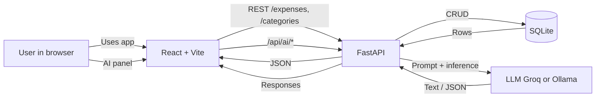
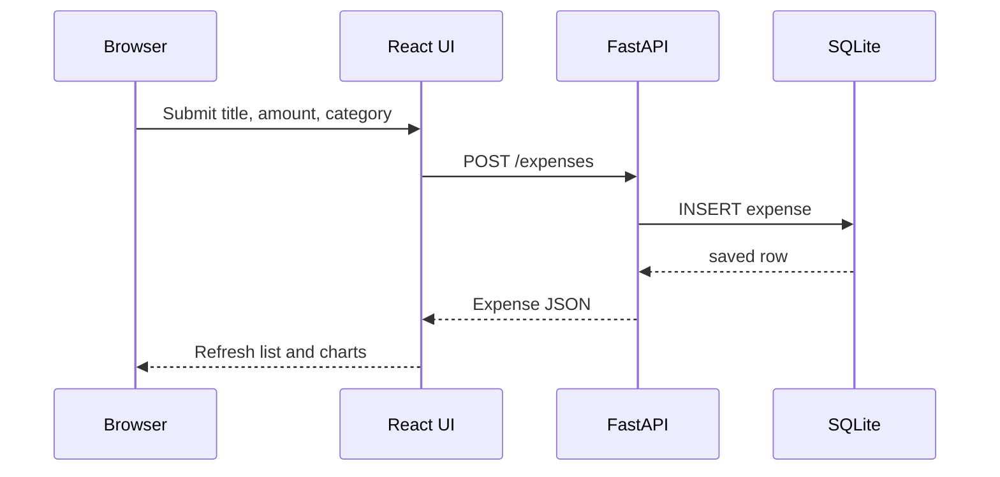

# Expense Tracker flow diagrams

The **same diagrams** are embedded in the root [`README.md`](../README.md) so they show inline on GitHub. This file is a convenient copy when browsing `docs/`.

## System context

## Creating an expense from the UI

## Notes

- Analytics (`total`, `by_category`, etc.) are computed in backend core logic from stored expenses.
- AI endpoints use the configured LLM provider (e.g. Groq or Ollama) with safe fallbacks.
- The frontend supports demo data loading and local budget tracking for quick testing.
