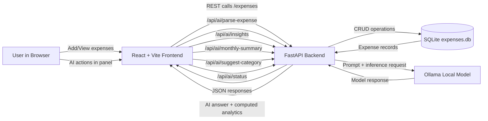

# Expense Tracker Flow Diagram

## Quick Notes

- Analytics (`total`, `by_category`, `largest`, `avg`) are deterministic and computed in backend core logic.
- AI endpoints use Ollama for parsing and narrative insights while the backend enforces safe fallbacks.
- The frontend also supports demo data loading and local budget tracking for quick testing.
